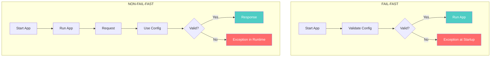
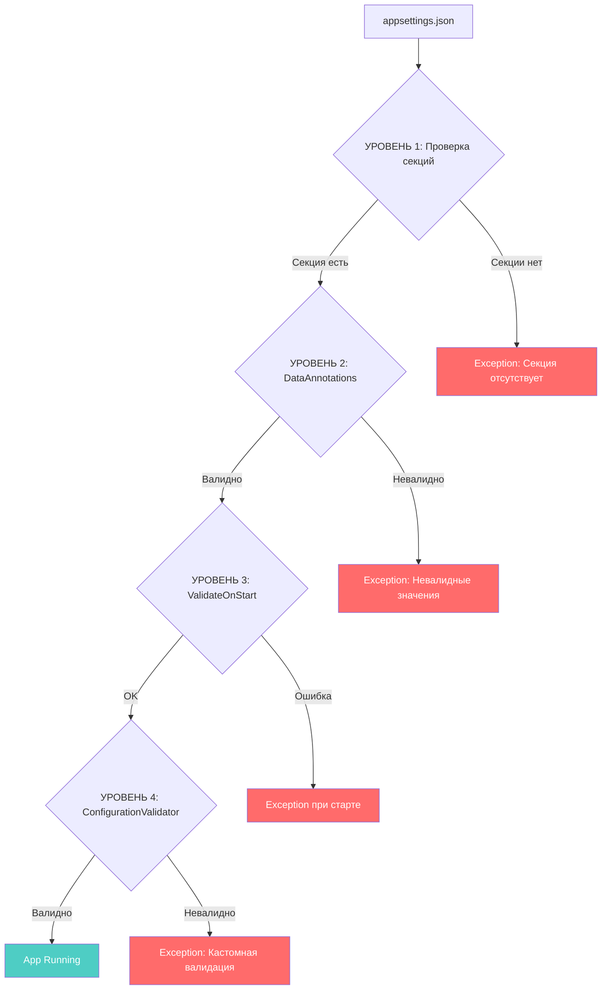
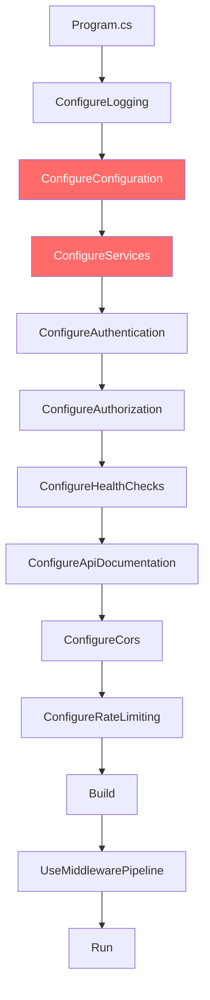

# Fail-Fast Principle

## Суть

Приложение **не должно стартовать**, если конфигурация невалидна. Лучше упасть сразу, чем в runtime при первом запросе.

## Fail-fast vs Non-fail-fast



## Примеры

| Сценарий | Fail-fast | Non-fail-fast |
|----------|-----------|---------------|
| Нет connection string | Приложение не стартует | Падает при первом запросе к БД |
| Невалидный JWT key | Приложение не стартует | Падает при первой аутентификации |
| Недоступен Redis | Приложение не стартует | Падает при первом обращении к кешу |
| Нет секции конфигурации | Приложение не стартует | Падает при использовании |

## 4 уровня валидации конфигурации



### Уровень 1: Проверка наличия секций

```csharp
// Проверяем что каждая секция существует
var jwtSection = configuration.GetSection("Jwt");
if (!jwtSection.Exists())
    throw new InvalidOperationException("Секция 'Jwt' отсутствует в конфигурации");

var dbSection = configuration.GetSection("Database");
if (!dbSection.Exists())
    throw new InvalidOperationException("Секция 'Database' отсутствует в конфигурации");
```

### Уровень 2: DataAnnotations

```csharp
public sealed class JwtSettings
{
    [Required(ErrorMessage = "JWT Key обязателен")]
    public string Key { get; set; } = null!;

    [Required(ErrorMessage = "JWT Issuer обязателен")]
    public string Issuer { get; set; } = null!;

    [Range(1, 1440, ErrorMessage = "ExpireMinutes: от 1 до 1440")]
    public int ExpireMinutes { get; set; } = 60;
}
```

### Уровень 3: ValidateOnStart

```csharp
builder.Services.AddOptions<JwtSettings>()
    .BindConfiguration("Jwt")
    .ValidateDataAnnotations()
    .ValidateOnStart();  // Валидация при старте, не в runtime!
```

### Уровень 4: ConfigurationValidator

```csharp
public sealed class ConfigurationValidator
{
    private readonly IConfiguration _configuration;

    public ConfigurationValidationResult Validate()
    {
        var errors = new List<string>();

        // Проверка connection string
        var connString = _configuration.GetConnectionString("Default");
        if (string.IsNullOrEmpty(connString))
            errors.Add("Connection string 'Default' отсутствует");

        // Проверка JWT key
        var jwtKey = _configuration["Jwt:Key"];
        if (string.IsNullOrEmpty(jwtKey) || jwtKey.Length < 32)
            errors.Add("JWT Key должен быть не менее 32 символов");

        return new ConfigurationValidationResult(errors);
    }
}
```

## Где в Program.cs происходит валидация



Конфигурация валидируется на шаге **ConfigureConfiguration** (самый ранний stage).
