# Middleware Pipeline

## Что такое Middleware

Middleware — компонент, обрабатывающий HTTP-запросы в pipeline. Каждый компонент получает запрос, обрабатывает и передаёт дальше.

## Request/Response flow

```
[Request]
    │
    ▼
[Middleware 1] ──→ [Middleware 2] ──→ [Middleware 3] ──→ [Endpoint]
                                                            │
[Response] ←── [Middleware 1] ←── [Middleware 2] ←── [Middleware 3] ←┘
```

## Порядок middleware (критичен)

```
1. Exception Handler      ← Ловит ошибки всех остальных
2. HSTS                   ← HTTPS strict transport
3. HTTPS Redirection      ← Редирект на HTTPS
4. CORS                   ← Cross-origin requests
5. Rate Limiting          ← Защита от DoS
6. Authentication         ← Аутентификация
7. Authorization          ← Авторизация
8. Routing                ← Маршрутизация
9. Endpoints              ← Контроллеры
```

## Что будет при неправильном порядке

| Нарушение | Последствие |
|-----------|-------------|
| CORS после Auth | Preflight requests не обрабатываются |
| Exception Handler после Auth | Ошибки auth не логируются |
| Auth после Routing | Endpoints доступны без аутентификации |
| Rate Limiting после Auth | DoS атака нагружает auth |

## Middleware в ASP.NET Core

```csharp
// Порядок в Program.cs (через MiddlewareConfigurator)
app.UseExceptionHandler();        // 1
app.UseHsts();                    // 2
app.UseHttpsRedirection();        // 3
app.UseCors();                    // 4
app.UseRateLimiter();             // 5
app.UseAuthentication();          // 6
app.UseAuthorization();           // 7
app.UseRouting();                 // 8
app.MapControllers();             // 9
```

## Типы middleware

| Тип | Назначение | Пример |
|-----|-----------|--------|
| **Built-in** | Стандартные ASP.NET | UseRouting, UseAuthentication |
| **Custom** | Свои компоненты | CorrelationIdMiddleware, RequestLoggingMiddleware |
| **Terminal** | Последний в pipeline | MapControllers, MapGet |

## Middleware vs Filter vs Action

| Механизм | Где работает | Когда |
|----------|-------------|-------|
| **Middleware** | До/после MVC pipeline | Общая логика (logging, auth) |
| **Filter** | Внутри MVC pipeline | Специфичная логика (validation, exception) |
| **Action** | Внутри метода | Бизнес-логика |

## Diagram: Middleware Pipeline

```mermaid
graph LR
    A[Request] --> B[Exception Handler]
    B --> C[HSTS]
    C --> D[HTTPS Redirection]
    D --> E[CORS]
    E --> F[Rate Limiting]
    F --> G[Authentication]
    G --> H[Authorization]
    H --> I[Routing]
    I --> J[Endpoints]
    J --> K[Response]

    style B fill:#ff6b6b,color:#fff
    style G fill:#4ecdc4,color:#fff
    style H fill:#4ecdc4,color:#fff
```


