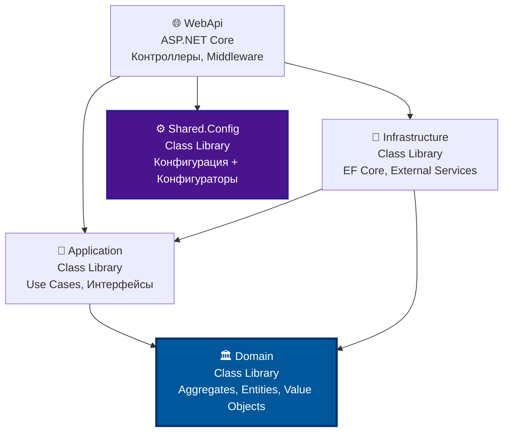

# Структура решения (DDD)

## Диаграмма зависимостей



## Структура каталогов с типами проектов

```
MicroserviceTemplate/
│
├── src/                                    # Исходный код
│   │
│   ├── MicroserviceTemplate.WebApi/        # 🌐 ASP.NET Core Web API
│   │   ├── Controllers/
│   │   │   └── MetadataController.cs
│   │   ├── Middlewares/
│   │   │   ├── GlobalExceptionHandlerMiddleware.cs
│   │   │   ├── CorrelationIdMiddleware.cs
│   │   │   └── RequestLoggingMiddleware.cs
│   │   ├── Filters/
│   │   │   └── ValidationFilter.cs
│   │   ├── Results/
│   │   │   ├── Result.cs
│   │   │   ├── ResultExtensions.cs
│   │   │   ├── ValidationResult.cs
│   │   │   └── Error.cs
│   │   ├── Program.cs                      # Минимальный! Только вызовы конфигураторов
│   │   ├── appsettings.json
│   │   ├── appsettings.Development.json
│   │   ├── appsettings.Production.json
│   │   └── MicroserviceTemplate.WebApi.csproj
│   │
│   ├── MicroserviceTemplate.Application/   # 🎯 Class Library (Use Cases)
│   │   ├── Common/
│   │   │   ├── Behaviors/
│   │   │   │   ├── ValidationBehavior.cs
│   │   │   │   └── LoggingBehavior.cs
│   │   │   └── Interfaces/
│   │   │       └── ICurrentUser.cs
│   │   ├── Interfaces/                     # Только интерфейсы, без реализации!
│   │   └── MicroserviceTemplate.Application.csproj
│   │
│   ├── MicroserviceTemplate.Domain/        # 🏛️ Class Library (DDD Core)
│   │   ├── Common/                         # Только базовые классы!
│   │   │   ├── BaseEntity.cs
│   │   │   ├── BaseAggregateRoot.cs
│   │   │   └── BaseValueObject.cs
│   │   ├── Exceptions/
│   │   │   └── DomainException.cs
│   │   └── MicroserviceTemplate.Domain.csproj
│   │
│   ├── MicroserviceTemplate.Infrastructure/# 🔧 Class Library (EF Core, Services)
│   │   ├── Persistence/
│   │   │   ├── ApplicationDbContext.cs
│   │   │   └── Interceptors/
│   │   │       ├── AuditInterceptor.cs
│   │   │       └── SoftDeleteInterceptor.cs
│   │   ├── Services/
│   │   │   ├── CurrentUser.cs
│   │   │   └── DateTimeService.cs
│   │   ├── DependencyInjection.cs
│   │   └── MicroserviceTemplate.Infrastructure.csproj
│   │
│   └── Shared.Config/                      # ⚙️ Class Library (Configuration)
│       ├── Configuration/
│       │   ├── JwtSettings.cs
│       │   ├── DatabaseSettings.cs
│       │   ├── RedisSettings.cs
│       │   ├── CorsSettings.cs
│       │   └── SerilogSettings.cs
│       ├── Providers/
│       │   ├── VaultConfigurationProvider.cs
│       │   ├── FileConfigurationProvider.cs
│       │   └── EnvironmentConfigurationProvider.cs
│       ├── Validation/
│       │   ├── ConfigurationValidator.cs
│       │   └── ConfigurationValidationException.cs
│       ├── Configurators/                  # Все конфигураторы здесь!
│       │   ├── ServiceConfigurator.cs
│       │   ├── MiddlewareConfigurator.cs
│       │   ├── ConfigurationConfigurator.cs
│       │   ├── AuthenticationConfigurator.cs
│       │   ├── AuthorizationConfigurator.cs
│       │   ├── HealthCheckConfigurator.cs
│       │   ├── LoggingConfigurator.cs
│       │   ├── ApiDocumentationConfigurator.cs
│       │   ├── CorsConfigurator.cs
│       │   └── RateLimitingConfigurator.cs
│       ├── Extensions/
│       │   └── ConfigurationExtensions.cs
│       └── Shared.Config.csproj
│
├── tests/                                  # Тестовые проекты (xUnit / TUnit)
│   ├── MicroserviceTemplate.WebApi.Tests/
│   ├── MicroserviceTemplate.Application.Tests/
│   ├── MicroserviceTemplate.Domain.Tests/
│   ├── MicroserviceTemplate.Infrastructure.Tests/
│   └── Shared.Config.Tests/
│
├── docs/
├── deploy/
│
├── MicroserviceTemplate.sln                # Solution file
├── .editorconfig
├── .gitignore
├── Directory.Build.props                   # Общие MSBuild properties
├── Directory.Packages.props                # Central package management
├── README.md
├── CONTRIBUTING.md
└── LICENSE
```

## Типы проектов

| Проект             | Тип                        | Назначение                                    |
| ------------------ | -------------------------- | --------------------------------------------- |
| **WebApi**         | ASP.NET Core Web API       | Контроллеры, middleware, Program.cs           |
| **Application**    | Class Library              | Use Cases, интерфейсы (без реализации)        |
| **Domain**         | Class Library              | Ядро DDD: Aggregates, Entities, Value Objects |
| **Infrastructure** | Class Library              | Реализация: EF Core, внешние сервисы          |
| **Shared.Config**  | Class Library              | Конфигурация + конфигураторы                  |
| **\*.Tests**       | Test Project (xUnit/TUnit) | Тесты для каждого проекта                     |

## Зависимости (текстовая схема)

```
WebApi ──→ Application ──→ Domain
   │            │
   │            └──→ Domain
   │
   ├──→ Infrastructure ──→ Application
   │            │
   │            └──→ Domain
   │
   └──→ Shared.Config (независимый)
```

## Слои

| Слой               | Проект         | Тип           | Назначение                                | Зависит от                                 |
| ------------------ | -------------- | ------------- | ----------------------------------------- | ------------------------------------------ |
| **Presentation**   | WebApi         | Web API       | Контроллеры, middleware, API              | Application, Infrastructure, Shared.Config |
| **Application**    | Application    | Class Library | Use Cases, интерфейсы                     | Domain                                     |
| **Domain**         | Domain         | Class Library | Ядро: Aggregates, Entities, Value Objects | **Ни от кого**                             |
| **Infrastructure** | Infrastructure | Class Library | Реализация: EF Core, внешние сервисы      | Application, Domain                        |
| **Config**         | Shared.Config  | Class Library | Конфигурация + конфигураторы              | **Ни от кого**                             |
| **Tests**          | \*.Tests       | Test Project  | Тесты для каждого проекта                 | Тестируемый проект                         |

---
